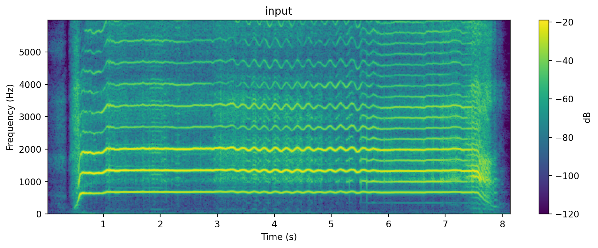
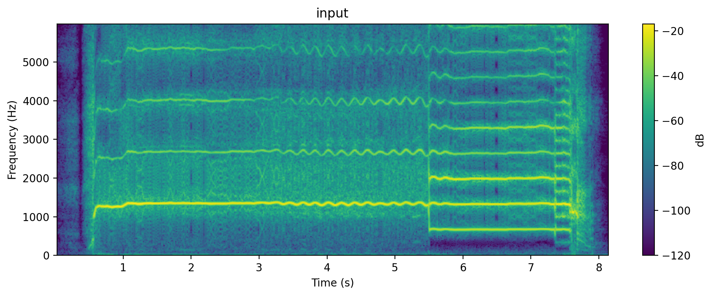
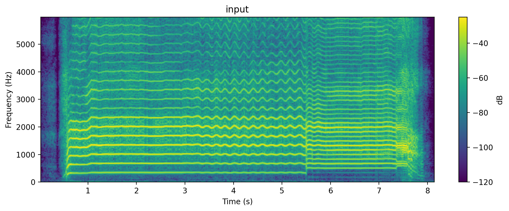
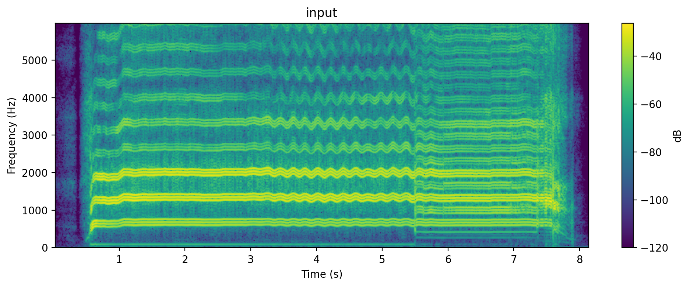
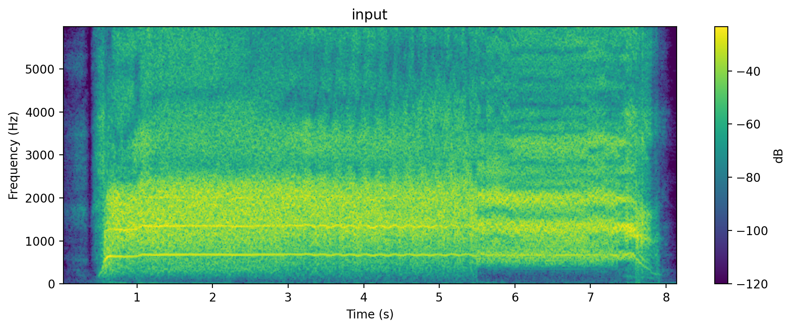

<h1 align="center">TD-PSOLA</h1>

<p align="center">
  <b>Time-domain</b><br/>
  <b>pitch shifting | time stretching | formant shifting</b><br/>
  Built on <i>Time-Domain Pitch-Synchronous Overlap and Add (TD-PSOLA)</i>
</p>
<hr/>

## ✨ What is this?</h2>

A small experimental TD-PSOLA engine that can:

- Pitch shift
- Time stretch
- Preserve/adjust formants

---

## 🧪 Results & Experiments</h2>

<p align="center">
input | 12 semitones up | 12 semitones down
</p>

<p align="center">
  
  
  
</p>

<p align="center">
drive distortion | fry distortion
</p>

<p align="center">
  
  
</p>

<p align="center">
  <sub>for more experiments, please check audio folder</sub>
</p>

---

## ⚙️ Installation

Dependencies:

```bash
pip install numpy soundfile praat-parselmouth
```

Note: ```praat-parselmouth``` is used for pitch estimation and epoch marking

---

## 🎈 Usage

<h3>Example: 12 semitones shift</h3>

```python
import soundfile as sf
from td_psola import td_psola # or paste the function into your script

audio, sr = sf.read("input_audio.wav")

result = td_psola(
    audio, sr,
    pitch_semitones=12,
    stretch_factor=1.0,
)

sf.write("output_audio.wav", result, sr)</code></pre>
```

---

<p align="center">
  <sub>made with questionable sleep schedules please I am suffering</sub>
</p>
